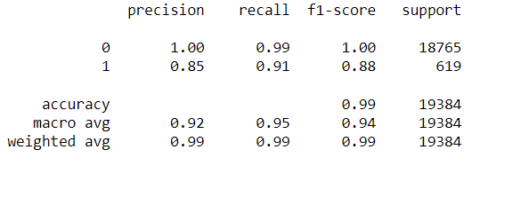

# credit-risk-classification

Machine learning techniques are used to analyze a dataset of historical lending activity from a peer-to-peer lending services company to build a model that can identify the creditworthiness of borrowers.

# Overview of the Analysis
Factors considered in the analysis included data on:

# Instructions
-- This homework consists of the following subsections:

-- Split the Data into Training and Testing Sets

-- Create a Logistic Regression Model with the Original Data

-- Predict a Logistic Regression Model with Resampled Training Data

-- Write a Credit Risk Analysis Report

# Overview of the Analysis
The purpose of this analysis is to build a model that can identify the creditworthiness of borrowers.
A dataset of historical lending activity from a peer-to-peer lending services company was used.
Dependant variable (y value) in this analysis was the "loan status" indicating if a loan is healthy or at risk.
Independent Variables (x values) were loan size, interest rate, borrower income, debt to income ratio, number of accounts and derogatory marks.
In this analysis, we first split our data to traning and test sets. Then, define our dependent and independent variables. Next, we create logistic regression model and fit our original data to this model. Trained model is used to make predictions. Lastly, we evaluate the model`s performance.
Two diffeent Logistic Regression models were created by using the original data set and randomy over resampled data set (to get rid of the imbalances). In the end, their results -which was gathered with scikit-learn library- were compared.

# Logistic Regression Model with Original Data

# Results
Logistic Regression Model 1:

Precision: 93% (an average--in predicting low-risk loans, the model was 100% precise, though the model was only 85% precise in predicting high-risk loans)
Accuracy: 94%
Recall: 95% (an average--the model had 100% recall in predicting low-risk loans, but 91% recall in predicting high-risk loans)